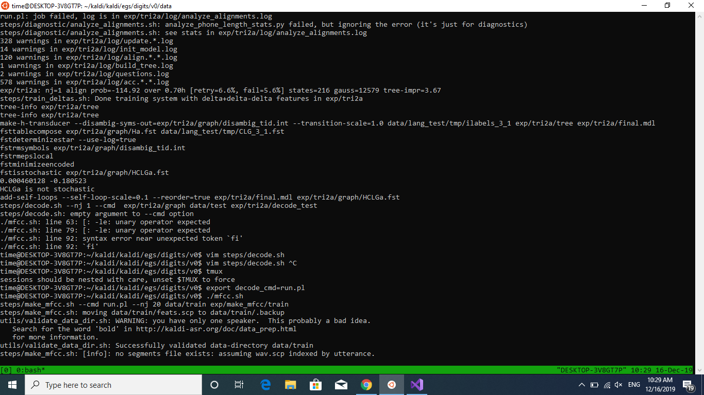
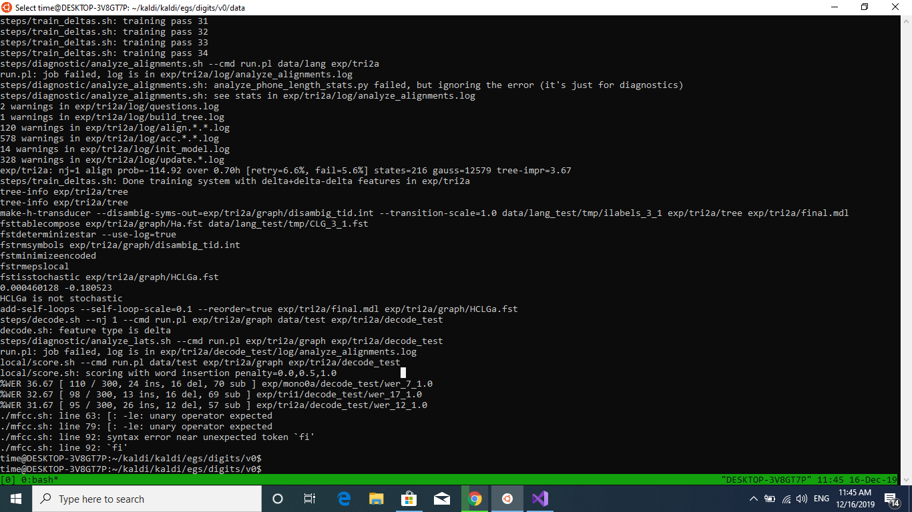
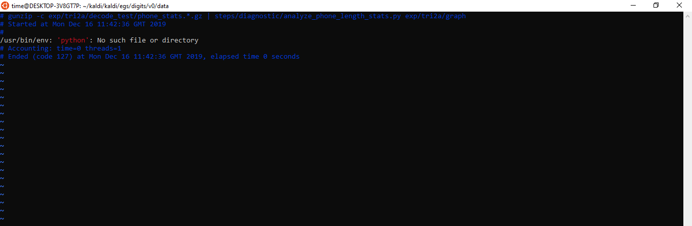
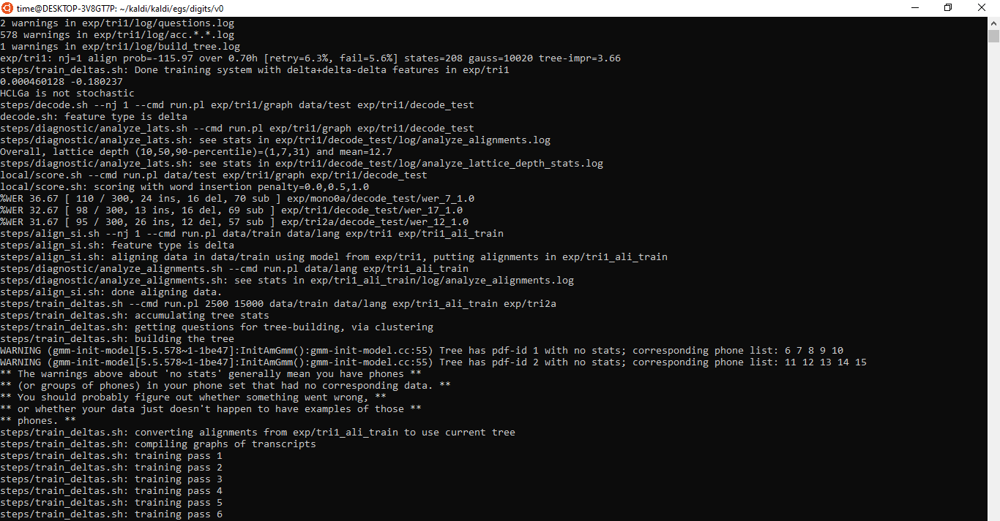
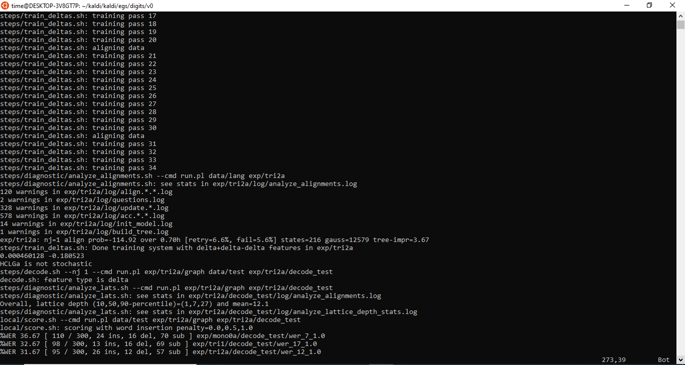
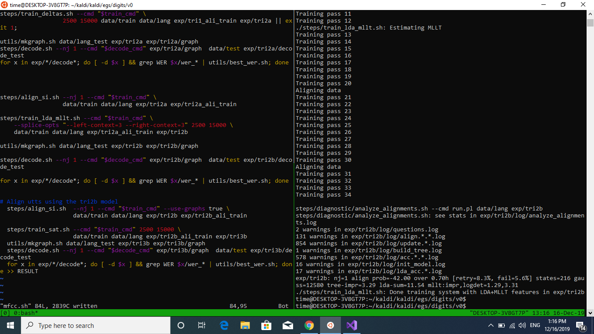
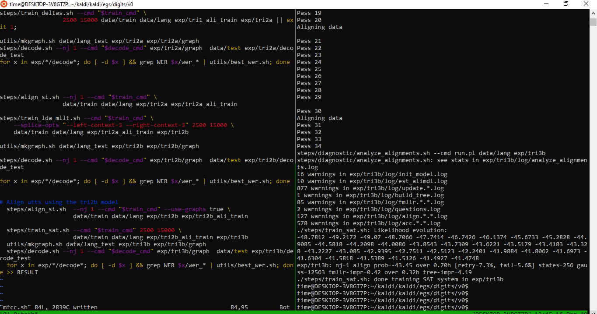
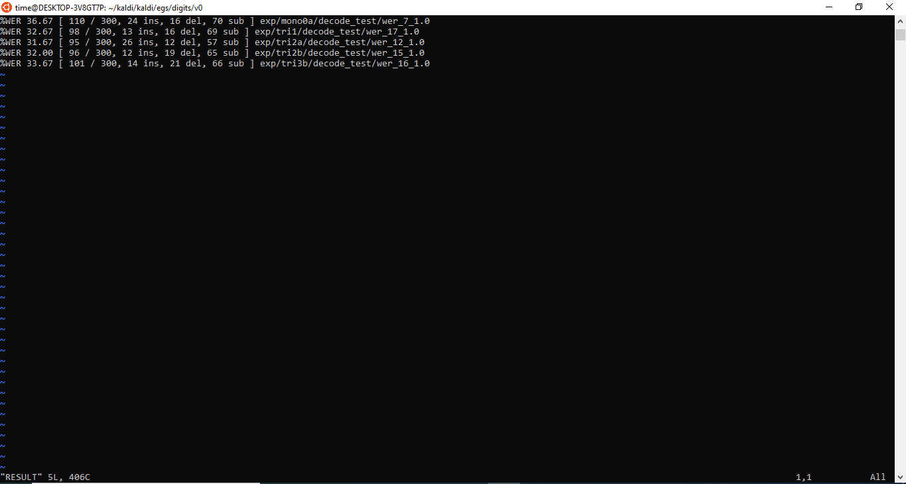

# Kaldi-Debugging

## Errors

1. `compute-mfcc-feats` command not found: 
    1. In `run.sh`, it calls `$KALDI_ROOT/tools/config/common_path.sh`. It should do `export PATH=$KALDI_ROOT/src/featbin` etc. but it doesn't happen. So, do it separately on your terminal.

	```shell
	export KALDI_ROOT=/home/wireless/Documents/kaldi
	export PATH=$KALDI_ROOT/src/featbin:$PATH
	```
2. `qsub: command not found` (This comes when using queue.pl file):
    1. `qsub` is used for parallelization, to allow using multiple systems at a time. To use everything on a single system only, open `cmd.sh` and set `export train_cmd="run.pl"`. That's it.
3. Below is a warning, freely ignore. It should work, after a few passes. If it doesn't, check where `queue.pl` is being called.
  ```sh
  queue.pl: Error submitting jobs to queue (return status was 256)
queue log file is exp/mono/decode_nosp_tgsmall_dev_clean_2/q/decode.log, command was qsub -v PATH -cwd -S /bin/bash -j y -l arch=*64* -o exp/mono/decode_nosp_tgsmall_dev_clean_2/q/decode.log   -l mem_free=4G,ram_free=4G  -t 1:10 /home/wireless/Documents/kaldi/egs/mini_librispeech/s5/exp/mono/decode_nosp_tgsmall_dev_clean_2/q/decode.sh >>exp/mono/decode_nosp_tgsmall_dev_clean_2/q/decode.log 2>&1
  ```
4. Rename every word of `queue.pl` in `cmd.sh` to `run.pl`. As mentioned in the documentation of `cmd.sh`:

5. Final error
```
ERROR (arpa-to-const-arpa[5.5.551~1-ab365]:Write():const-arpa-lm.cc:519) ConstArpaLm <LmStates> section writing failed.

[ Stack-Trace: ]
/home/wireless/Documents/kaldi/src/lib/libkaldi-base.so(kaldi::MessageLogger::LogMessage() const+0xb42) [0x7f532e97d6a2]
arpa-to-const-arpa(kaldi::MessageLogger::LogAndThrow::operator=(kaldi::MessageLogger const&)+0x21) [0x5607b22e0a31]
/home/wireless/Documents/kaldi/src/lib/libkaldi-lm.so(kaldi::ConstArpaLm::Write(std::ostream&, bool) const+0x243) [0x7f532ede4c9b]
/home/wireless/Documents/kaldi/src/lib/libkaldi-lm.so(kaldi::ConstArpaLmBuilder::Write(std::ostream&, bool) const+0x107) [0x7f532ede4fef]
/home/wireless/Documents/kaldi/src/lib/libkaldi-lm.so(kaldi::BuildConstArpaLm(kaldi::ArpaParseOptions const&, std::__cxx11::basic_string<char, std::char_traits<char>, std::allocator<char> > const&, std::__cxx11::basic_string<char, std::char_traits<char>, std::allocator<char> > const&)+0x292) [0x7f532ede5469]
arpa-to-const-arpa(main+0x344) [0x5607b22e079e]
/lib/x86_64-linux-gnu/libc.so.6(__libc_start_main+0xe7) [0x7f532e001b97]
arpa-to-const-arpa(_start+0x2a) [0x5607b22e037a]

ERROR (arpa-to-const-arpa[5.5.551~1-ab365]:~Output():kaldi-io.cc:694) Error closing output file data/lang_test_tglarge/G.carpa (disk full?)

[ Stack-Trace: ]
/home/wireless/Documents/kaldi/src/lib/libkaldi-base.so(kaldi::MessageLogger::LogMessage() const+0xb42) [0x7f532e97d6a2]
arpa-to-const-arpa(kaldi::MessageLogger::LogAndThrow::operator=(kaldi::MessageLogger const&)+0x21) [0x5607b22e0a31]
/home/wireless/Documents/kaldi/src/lib/libkaldi-util.so(kaldi::Output::~Output()+0x110) [0x7f532eb9ec38]
/home/wireless/Documents/kaldi/src/lib/libkaldi-lm.so(kaldi::BuildConstArpaLm(kaldi::ArpaParseOptions const&, std::__cxx11::basic_string<char, std::char_traits<char>, std::allocator<char> > const&, std::__cxx11::basic_string<char, std::char_traits<char>, std::allocator<char> > const&)+0x35c) [0x7f532ede5533]
arpa-to-const-arpa(main+0x344) [0x5607b22e079e]
/lib/x86_64-linux-gnu/libc.so.6(__libc_start_main+0xe7) [0x7f532e001b97]
arpa-to-const-arpa(_start+0x2a) [0x5607b22e037a]

terminate called after throwing an instance of 'kaldi::KaldiFatalError'
  what():  kaldi::KaldiFatalError
utils/build_const_arpa_lm.sh: line 47: 14151 Aborted                 (core dumped) arpa-to-const-arpa --bos-symbol=$bos --eos-symbol=$eos --unk-symbol=$unk "gunzip -c $arpa_lm | utils/map_arpa_lm.pl $new_lang/words.txt|" $new_lang/G.carpa
```

## Debugging for Kaldi ASR Project

1. 
2. Running Training code for Kaldi, nothing after `--cmd`. Trying to run the code again with `export cmd=run.pl` explicitly on the shell.
	
3. The Step-2 doesn't solve the problem, fault: I didn't look at the run.sh file, and it uses `"$decode_cmd"`. So again doing: `export decode_cmd=run.pl`.
	
4. After Step-3, another error. This time the error is saved in a log:
	
5. In the Step-4, it says the log has details. Below is the screenshot of the log:
	
6. Solution: `sudo apt-get install python`. Now trying again...
7. Error:
	```
	tree-info exp/mono0a/tree
	tree-info exp/mono0a/tree
	make-h-transducer --disambig-syms-out=exp/mono0a/graph_tgpr/disambig_tid.int --transition-scale=1.0 data/lang_test/tmp/ilabels_1_0 exp/mono0a/tree exp/mono0a/final.mdl
	fsttablecompose exp/mono0a/graph_tgpr/Ha.fst data/lang_test/tmp/CLG_1_0.fst
	fstdeterminizestar --use-log=true
	fstrmsymbols exp/mono0a/graph_tgpr/disambig_tid.int
	fstrmepslocal
	fstminimizeencoded
	fstisstochastic exp/mono0a/graph_tgpr/HCLGa.fst
	add-self-loops --self-loop-scale=0.1 --reorder=true exp/mono0a/final.mdl exp/mono0a/graph_tgpr/HCLGa.fst
	tree-info exp/tri1/tree
	tree-info exp/tri1/tree
	make-h-transducer --disambig-syms-out=exp/tri1/graph/disambig_tid.int --transition-scale=1.0 data/lang_test/tmp/ilabels_3_1 exp/tri1/tree exp/tri1/final.mdl
	fsttablecompose exp/tri1/graph/Ha.fst data/lang_test/tmp/CLG_3_1.fst
	fstdeterminizestar --use-log=true
	fstrmsymbols exp/tri1/graph/disambig_tid.int
	fstrmepslocal
	fstminimizeencoded
	fstisstochastic exp/tri1/graph/HCLGa.fst
	add-self-loops --self-loop-scale=0.1 --reorder=true exp/tri1/final.mdl exp/tri1/graph/HCLGa.fst
	tree-info exp/tri2a/tree
	tree-info exp/tri2a/tree
	make-h-transducer --disambig-syms-out=exp/tri2a/graph/disambig_tid.int --transition-scale=1.0 data/lang_test/tmp/ilabels_3_1 exp/tri2a/tree exp/tri2a/final.mdl
	fstdeterminizestar --use-log=true
	fsttablecompose exp/tri2a/graph/Ha.fst data/lang_test/tmp/CLG_3_1.fst
	fstrmepslocal
	fstminimizeencoded
	fstrmsymbols exp/tri2a/graph/disambig_tid.int
	fstisstochastic exp/tri2a/graph/HCLGa.fst
	add-self-loops --self-loop-scale=0.1 --reorder=true exp/tri2a/final.mdl exp/tri2a/graph/HCLGa.fst
	./mfcc.sh: line 63:  -le: unary operator expected
	./mfcc.sh: line 79:  -le: unary operator expected
	./mfcc.sh: line 92: syntax error near unexpected token `fi'
	./mfcc.sh: line 92: `fi'
	```
8. 
9. 
10. 
11. 

Everything done!

## RESULT

